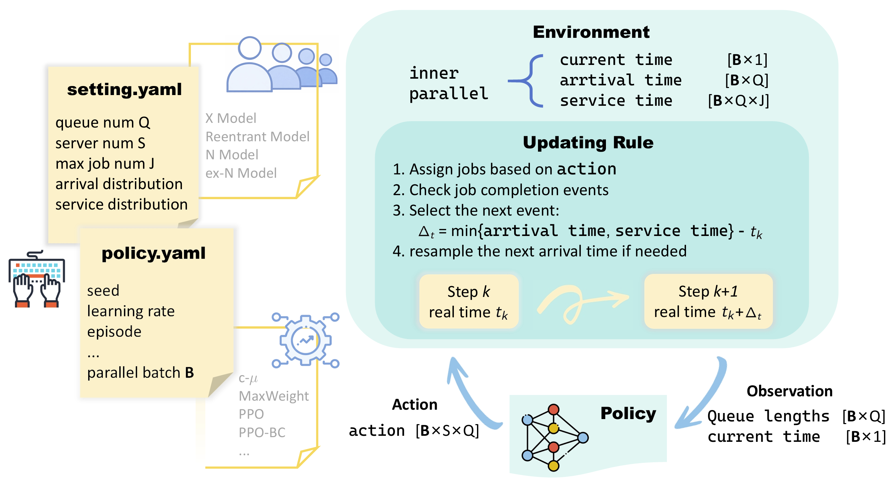
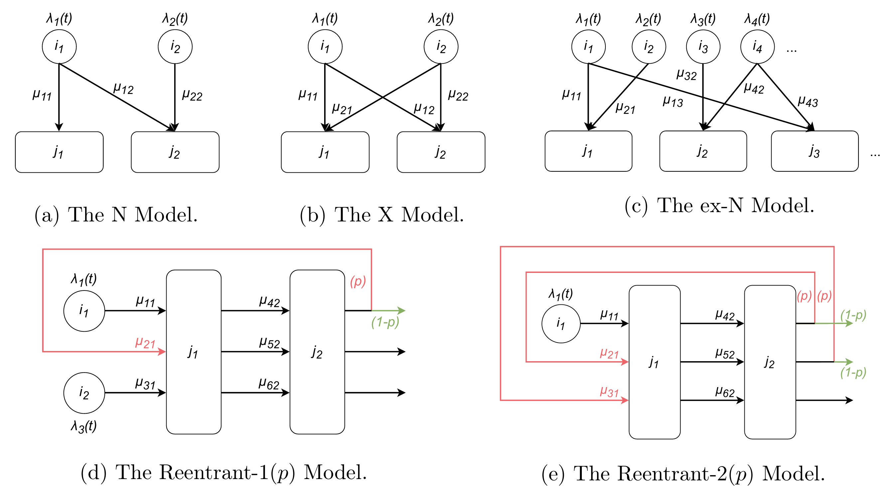
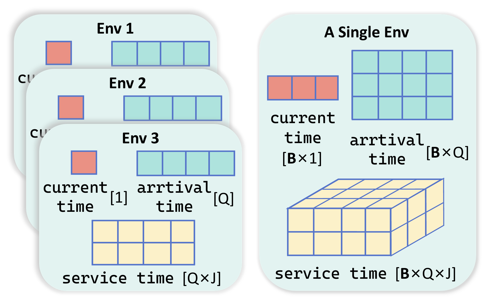
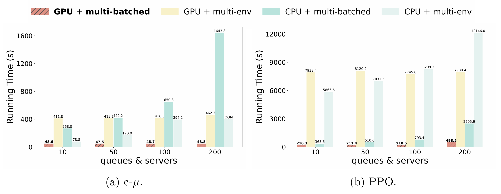
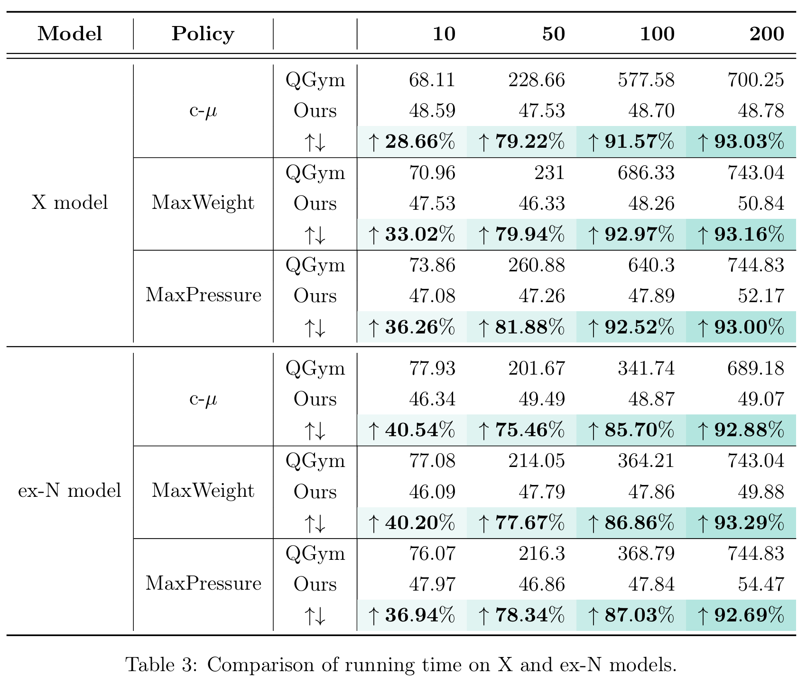

# QuRL  
  
**A Fast GPU-Accelerated Reinforcement Learning Framework for Large-Scale Queuing Networks**  

QuRL is a GPU-accelerated reinforcement learning framework for simulating and controlling large-scale queuing networks. It provides efficient parallel simulation and a modular RL interface to support both classical queueing policies and modern reinforcement learning algorithms.  

<p align="center">  </p>

## Key Features
1. Flexible configuration of environments.
2. Efficient integration with multiple algorithms.
3. Fully tensorized implementation.
4. Inner-batched simulation on GPUs.

## Flexible Configuration of Environments
QuRL provides flexible configuration of queuing networks, supporting different models, customizable queue and server sizes, arrival and service rates, and user-defined distributions.

#### Supported Queuing Models  

<p align="center">  </p>
  
1. N Model: Two queues and two servers where one server may serve both queues.
2. X Model: A more flexible structure where servers can serve all queues.
3. ex-N Model: Generalized system with arbitrary numbers of queues and servers.
4. Reentrant Model: Jobs may re-enter the system after service completion with a given probability.  

#### File stucture of Configs/
##### `configs/env`
Predefined queuing network environments are provided here.  An example: 
```YAML
name: ex-N_model_3  
lam_type: constant  
lam_params: {val: [0.65, 0.54, 0.22]}  
network: [[0, 1, 1], [1, 0, 0], [0, 1, 1]]  
mu: [[0, 0.02, 0.21], [0.50, 0, 0], [0, 0.02, 0.19]]  
h: [0.58, 0.80, 0.01]  
init_queues: [0, 0, 0]  
queue_event_options: null  
queue_event_options2: null  
train_T: 5000  
test_T: 5000
```
- **`network`** 
    Defines the connectivity between servers and queues. 
    Rows correspond to **servers**, and columns correspond to **queues*.  
    A value of `1` indicates that the server can process jobs from that queue.
- **`lam_params`**  
    Specifies the **arrival rates** of each queue.
- **`mu`**  
    Defines the **service rates** for each server–queue pair.
- **`h`**  
    Holding cost associated with each queue.
- **`queue_event_options` / `queue_event_options2`**  
    Control the **reentrant behavior** of jobs in the system.

##### `configs/env_data`
- This directory contains predefined environment data, including customized arrival rates (`lam`), service rates (`mu`), and network structures (`network`).  
- It also provides scripts for generating `queue_event_options` and inspecting the generated event data.
##### `configs/scripts`
These scripts can automatically generate environment configuration files (e.g. `setting.yaml`) for different queuing models and system sizes.
##### `configs/model`
This directory contains training hyperparameters.


## Efficient Integration with Multiple Algorithms
 
### Classical policies

#### Supported Classical policies
* c-µ policy  
* MaxWeight  
* MaxPressure  

#### Related File Stucture
`policies`: Implementation of classical control policies.

`main`
- `main/env.py`: Defines the queuing network environment.
- `main/run_comparison.py`: Entry point for experiments with classical policies. This script reads configuration files from configs and passes them to main/trainer.py.
- `main/trainer.py`: Implements training and evaluation for classical policies using **inner-batched parallelization**.
- `main/trainer_multi_env.py`:   An alternative implementation of `main/trainer.py`, using **multi-environment parallelization**.

##### Run

###### Way 1: directly run
1. Set the project path:
```bash
export PYTHONPATH=/root/QuRL
```
2. Run the experiment:
```bash
python -m main.run_comparison cmu n_model_mm_10
```

###### Way 2: slurm run

1. Open `run_classical_policies.sbatch` and modify:
	- the conda environment (currently py310, replace with your own environment)
	- PYTHONPATH
2. Submit the job.
```bash
sbatch run_classical_policies.sbatch
```


### RL algorithms
#### Supported Classical policies
* A2C  
* PPO  
* PPO with behavior cloning
* Work-conserving PPO
* Pathwise policy gradient  

#### File Stucture of RL/
`env/rl_env.py`: RL environment wrapper built on top of `main/env.py`.

`policy_configs/`: Configuration files for RL algorithms, including hyperparameters and training settings.

`train.py`  
Entry point for RL training. This script loads environment configurations from `configs`, reads policy settings from `RL/policy_configs`, and launches training through the trainers in `algorithms/` using **inner-batched parallelization**.

`train_multi_env.py`  
Alternative training script using **multi-environment parallelization**.

`algorithms/`: This is inner-batched
- `trainer_a2c`: Implementation of **Advantage Actor-Critic (A2C)**.
- `trainer_pathwise`: Implementation of the **pathwise policy gradient method**.
- `trainer_vanilla`: Implementation of **vanilla PPO**.
- `trainer_wc`: Implementation of **work-conserving PPO**.
- `trainer_wc2`:  Implementation of another type of work-conserving PPO,
which slows down updates when the KL divergence becomes too large to improve training stability.

##### Run

###### Way 1: directly run
1. Set the project path:
```bash
export PYTHONPATH=/root/QuRL
```
2. Run the experiment:
```bash
python RL/train.py a2c.yaml n_model_mm_10
```

###### Way 2: slurm run
1. Open `run_rl.sbatch` and modify:
	- the conda environment (currently py310, replace with your own environment)
	- PYTHONPATH
2. Submit the job.
```bash
sbatch run_crl.sbatch
```


## Fully Tensorized Implementation

QuRL is built on **TorchRL** and **TensorDict**, where all environment states are stored on the GPU. The entire simulation pipeline is fully tensorized, enabling efficient batch computation and eliminating CPU–GPU communication overhead. 




## Inner-batched Simulation on GPUs


QuRL adopts **inner-batched simulation**, where multiple environments are simulated within a single environment instance using an additional batch dimension. 


This design minimizes Python overhead and allows GPU tensor operations to execute all parallel environments simultaneously, significantly improving simulation throughput.

### Ablation Experiments

The following experiments compare different parallelization strategies (CPU/GPU and multi-env vs inner-batched).  

**"GPU + inner-batched"** simulation is **the fastest** setting across all tested system sizes.

<p align="center">  </p>

### Comparison with Baselines

We compare QuRL with **QGym**. 

As the number of queues and servers increases, QGym's runtime grows rapidly, while QuRL maintains nearly constant runtime due to GPU tensorization and inner-batched simulation.

<p align="center">  </p>

## Requirements
  
The project requires the following package versions.
- Python 3.10  
- PyTorch 2.5.1 + CUDA 12.1  
- TorchRL 0.6  
- TensorDict 0.6.1

### Installation
```
git clone https://github.com/jingqi-fan/QuRL.git  
cd QuRL

conda create -n py310 python=3.10 -y  
conda activate py310  

pip install torch==2.5.1+cu121 --extra-index-url https://download.pytorch.org/whl/cu121

pip install -r requirement.txt
```


